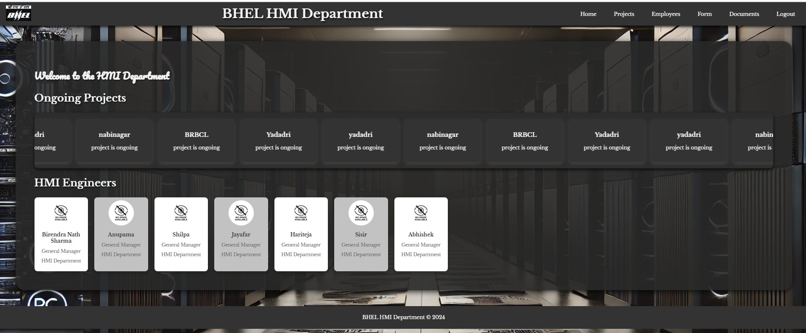
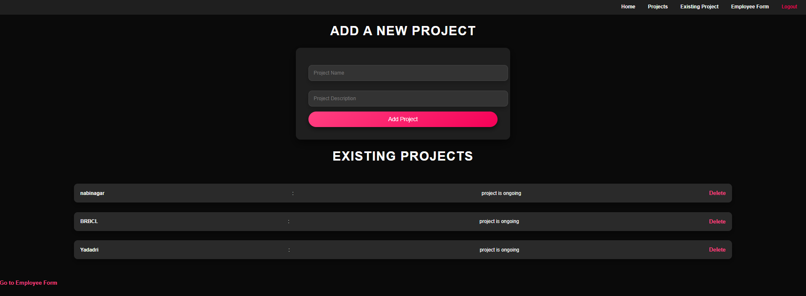
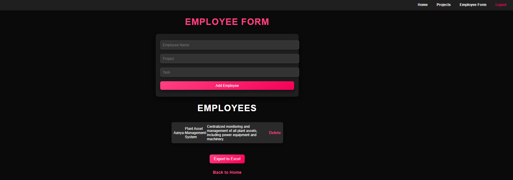
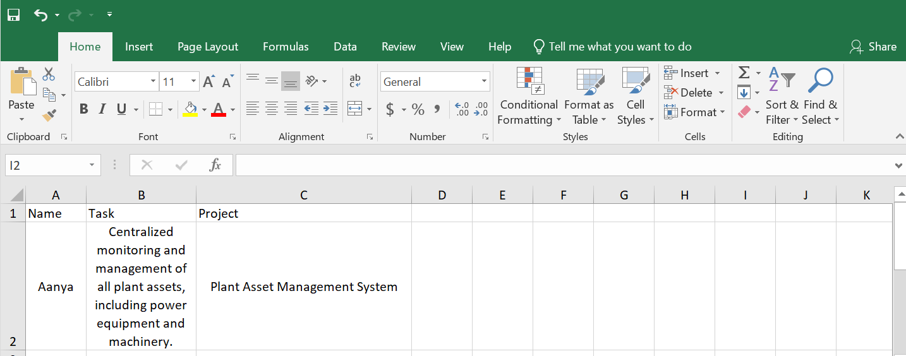

# HMI Department Project Management Application

## Welcome to the HMI Department  
This application is designed to streamline project management and employee tracking for the HMI Department. The platform provides an intuitive interface for managing ongoing projects, adding new projects, and assigning tasks to employees. Users can also export employee data to Excel, manage documentation, and securely log out of the system.

---

### Features  
- **Home Dashboard**: Overview of all ongoing projects.
 
- **Project Management**: Add new projects with a name and description.
   
- **Employee Management**: Add employees, assign them to projects, and allocate tasks.
    
- **Data Export**: Export employee details to Excel for reporting and analysis.
  
- **Form Management**: Upload and manage important documents related to projects and employees.  
- **Logout**: Secure user logout functionality.  

---

### Technology Stack  
- **Frontend**: Angular, HTML5, CSS3, Bootstrap  
- **Backend**: Spring Boot, RESTful APIs  
- **Database**: MySQL  

